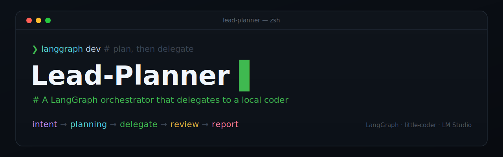

# Lead-Planner
<p align="center"></p>

A planning-and-orchestration agent built on a **LangGraph DAG**. It reads a
request, breaks it into tasks, writes the planning artifacts itself (user
stories, design docs, todos, work breakdowns), and delegates **all
implementation** to **little-coder** — a local coding model invoked as a CLI.
The planner thinks and coordinates; little-coder writes the code.

The traversal — which phase runs next, when to loop, when to retry, when to stop
— is owned by the graph, not the model. The LLM only does the work *inside* each
phase; the `StateGraph`'s edges, routers, and checkpointer enforce the phase
sequence, the delegate→review fix loop, the retry cap, and the human-in-the-loop
pauses.

Nothing about the workflow is hardcoded in Python. The shape of the DAG lives in
[`graph/workflow.yaml`](graph/workflow.yaml) and the per-phase instructions in
[`graph/phases/`](graph/phases/); the engine in
[`graph/lead_planner_graph/`](graph/lead_planner_graph/) is generic and reads
them at runtime. It is **model-agnostic** — the engine talks only to an `LLM`
Protocol, so the orchestrator model (the planner's reasoning) and the worker
model little-coder drives can each be any model you serve.

Everything lives under [`graph/`](graph/); the paths and commands below are
relative to that directory.

## How it works — the graph

```
        START
          │
        intent ──(interrupt: clarifying questions)
          │
       planning ──(interrupt: plan approval)
          │
   route_after_planning ── no components ─────────────┐
          │ has components                            │
          ▼                                           │
       delegate ◄───────────────────┐                 │
          │                         │                 │
        review                      │                 │
          │                         │                 │
   route_after_review               │                 │
     ├─ next  → delegate (next component)              │
     ├─ fix   → delegate (re-deliver, capped) ─────────┘
     ├─ done  → report                                 │
     └─ escalate → report ◄─────────────────────────────
          │
        report → END
```

- **Phases are nodes.** `intent`, `planning`, `delegate`, `review`, `report`.
- **Traversal is edges + routers.** Plain edges for the linear hops; two named
  routers (`route_after_planning`, `route_after_review`) for the branches.
- **The fix loop is a real cycle** delegate → review → delegate, **bounded in
  code** by `settings.max_fix_attempts`. The model no longer counts attempts.
- **Human-in-the-loop is built in.** The two pause points (clarifying questions,
  plan approval) are LangGraph `interrupt()` calls; a checkpointer persists state
  while the graph waits, and `Command(resume=...)` continues it.
- **The orchestrator runs the tests; little-coder never does.** Running and
  diagnosing test output is the planner's job; little-coder only writes code and
  tests, one cohesive component at a time, with deterministic tests.

## Getting set up

Three pieces work together:

1. **[LM Studio](https://lmstudio.ai/)** — runs the local models. Load **two**
   small models: one **orchestrator** (the planner's reasoning, used by the LLM
   adapter) and one **worker** (what little-coder drives). Any capable small
   local model works. Start LM Studio's local server.
2. **[little-coder](https://github.com/itayinbarr/little-coder)** — the CLI the
   planner delegates all implementation to, with a built-in LM Studio provider.
   Install it and confirm a sample call runs against your LM Studio server, then
   make sure it is on your `PATH`.
3. **The engine** — install the Python package (run from `graph/`):

   ```bash
   cd graph
   pip install -e ".[dev]"     # engine + langgraph-cli[inmem] + pytest
   cp .env.example .env         # point at your LM Studio server / model (optional)
   ```

The orchestrator model and LM Studio endpoint are set via the environment (see
`.env.example`); the worker model little-coder drives is set in `workflow.yaml`
(`settings.worker_model` / `worker_provider`).

## The dev interface — LangGraph Studio

The clean dev experience is **LangGraph Studio via `langgraph dev`** — a visual
graph debugger that runs locally and offline against your LM Studio. No cloud
account is needed for local dev.

```bash
langgraph dev               # starts the local server and opens Studio in the browser
```

`langgraph.json` is the manifest; it loads `lead_planner_graph/app.py:graph` (the
uncompiled `StateGraph`, so the dev server owns persistence). In Studio you get:

- the flowchart above as a live, clickable graph;
- step-through execution with the full `PlannerState` visible (and editable) at
  every node;
- **the two interrupts handled in the UI** — answer clarifying questions and
  approve/revise the plan in a panel instead of at a prompt;
- time-travel: fork from any past checkpoint and re-run.

Hot reload is on, so editing `workflow.yaml` or a `phases/*.md` file updates the
running graph.

### Troubleshooting `langgraph dev`

**`AttributeError: module 'langgraph_api.config' has no attribute 'LSD_PROM_METRICS_ENABLED'`** (or a similar missing-attribute crash during server startup). The dev server is two rolling `.dev` packages — `langgraph-api` and `langgraph-runtime-inmem` — and you've landed a `runtime-inmem` newer than the `langgraph-api` beside it. Realign them:

```bash
pip install -U "langgraph-cli[inmem]" langgraph-api langgraph-runtime-inmem
# still crashing? the runtime is ahead of the api — pick one:
pip install -U --pre langgraph-api                 # bring the api forward
pip install --pre "langgraph-runtime-inmem<0.31"   # or hold the runtime back
```

**Root cause is often Python 3.14.** These platform server packages don't reliably ship stable wheels for 3.14 yet, so pip falls back to mismatched pre-releases. Use a venv on 3.12/3.13 for the dev server:

```bash
python3.12 -m venv .venv && source .venv/bin/activate && pip install -e ".[dev]"
```

The core engine (`langgraph` 1.2.5) and the headless CLI runner are fine on 3.14 — only the visual dev server is sensitive. Confirm the graph itself with `python -m lead_planner_graph.run --demo`.

## Run it headless (CLI / CI)

```bash
pip install -r requirements.txt     # runtime only (no dev server / tests)

# Real run (needs LM Studio serving the orchestrator model + little-coder on PATH):
python -m lead_planner_graph.run --request "Build a thread-safe rate limiter" --workdir /path/to/project

# Offline demo (FakeLLM, no servers) — exercises interrupts + the fix loop:
python -m lead_planner_graph.run --demo

# Tests:
python -m pytest tests/ -q
```

When run headless the runner prints the clarifying questions or the plan and
reads your answer from stdin, then resumes exactly where it left off.

## Project layout

Everything is under `graph/`. The three extension points — `nodes/`, `routers/`,
and `llm/` — each follow the same shape: the implementations sit at the top of
the package, and the scaffolding they plug into lives in a `framework/`
subpackage. Node types and routers self-register via a decorator (`@node_type`,
`@router`), so adding one is just a new file — no central edit.

| Path | Role |
|------|------|
| `workflow.yaml` | The DAG: nodes, edges, routers, interrupts, and tunable `settings`. **Edit this to reshape the workflow.** |
| `phases/system.md` | Identity + routing rule + invariants, prepended to every node. |
| `phases/*.md` | One instruction file per phase, each ending with a small JSON output contract the engine parses. **Edit these to change phase behavior.** |
| `workflow-graph.md` | The rendered Mermaid DAG (regenerable). |
| `langgraph.json` | Manifest `langgraph dev` reads; points at the graph entrypoint. |
| `pyproject.toml` / `.env.example` | Packaging (incl. the `[dev]` extra) and the LM Studio env settings. |
| `lead_planner_graph/app.py` | The entrypoint Studio loads — builds the uncompiled graph from env + config. |
| `lead_planner_graph/builder.py` | Compiles the `StateGraph` from the config. |
| `lead_planner_graph/config.py` | Loads and validates the YAML + phase files. |
| `lead_planner_graph/state.py` | The typed `PlannerState` threaded through the graph. |
| `lead_planner_graph/run.py` | CLI runner that services interrupts from stdin. |
| `lead_planner_graph/llm/` | Pluggable LLM package: `framework/` (the `LLM` Protocol + JSON parsing) and one adapter per file (`lmstudio.py`, `fake.py`). |
| `lead_planner_graph/nodes/` | The node behaviors (`agent`, `delegate`, `review`) plus `framework/` (dependency injection, the shared toolkit, the little-coder integration, and the node-type dispatch). |
| `lead_planner_graph/routers/` | The branch functions (`planning`, `review`) plus `framework/` (the `@router` decorator + dispatch). |
| `tests/test_smoke.py` | End-to-end tests (no servers needed). |

## How a phase talks to the engine

Each `phases/*.md` ends with a JSON output contract. A phase does its reasoning
in prose, then emits one fenced ```json block the node parses:

- **intent** → `{ "intent": "...", "questions": [...] }` — non-empty `questions`
  triggers the clarification interrupt.
- **planning** → `{ "artifact_type": "...", "components": [...] }` — the
  components become the delegation queue; the prose above is the approved plan.
- **delegate** → `{ "prompt": "..." }` — the engine validates it against the
  shell-safety rules and wraps it in the full command.
- **review** → `{ "passed": bool, "notes": "...", "diagnosis": "..." }` — the
  engine trusts the *actual* pytest result for pass/fail and uses `diagnosis`
  for a capped fix re-delivery.

Want a different contract or a new phase? Add a `phases/*.md` file and a node
entry in `workflow.yaml`. Only a genuinely new *kind* of work needs new Python (a
node type in `nodes/` or a router in `routers/`, each self-registering via its
decorator).

## Adding an LLM provider

The engine talks only to the `LLM` Protocol (`complete(system, user) -> str`).
`LMStudioAdapter` ships for the local LM Studio server, and `FakeLLM` satisfies
the same contract for tests and the offline demo. To target another provider,
drop a new module in `lead_planner_graph/llm/` whose class implements
`complete(...)` — nothing imports it except whoever constructs it (`run.py` /
`app.py`).

## Lessons learned

- **Agent file size matters** — Compact instruction files give models too much room to drift. More detailed files provide better anchoring; optimal size depends on the model.
- **Multi-model review improves results** — Having separate models independently tackle a problem and combining their outputs surfaces blind spots a single model would miss.
- **Temperature controls determinism** — Lower temperatures produce more consistent, predictable outputs. Use higher temperatures only when exploration is the goal.
- **Less context can be better** — Flooding a model with context can hurt focus and reliability. Limiting the context window often makes smaller models behave more predictably.
- **Ambiguity gets exploited** — Models will find and use any gap in instructions. Clear, explicit language is the foundation of reliable behavior.
- **Agentic architecture has a learning curve** — Building reliable workflows requires understanding how components connect. LangGraph makes the structure of agentic systems explicit, turning abstract orchestration into something concrete and reasoned about.
