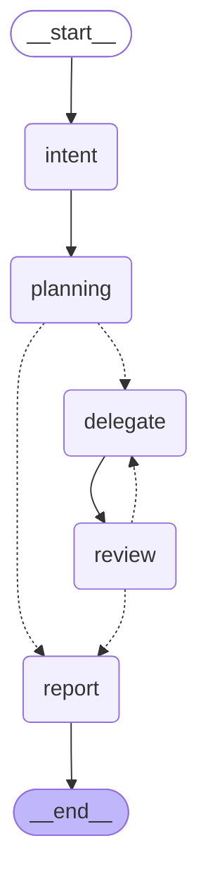

# lead-planner workflow graph

Rendered from `workflow.yaml` (`app.get_graph().draw_mermaid()`). Solid arrows
are plain edges; dotted arrows are router branches. Regenerate with:

```bash
python -c "from lead_planner_graph.config import load_config; from lead_planner_graph.builder import build_graph; from lead_planner_graph.fake_llm import FakeLLM; print(build_graph(load_config('workflow.yaml'), FakeLLM()).get_graph().draw_mermaid())"
```



Reading the branches:

- `planning -.-> delegate` / `planning -.-> report` — `route_after_planning`: go
  build if the plan has components, else skip straight to the report.
- `review -.-> delegate` — `route_after_review`: advance to the next component,
  **or** re-deliver the current one as a fix (bounded by
  `settings.max_fix_attempts`).
- `review -.-> report` — queue exhausted (everything passed) or the fix cap was
  hit (escalate).
